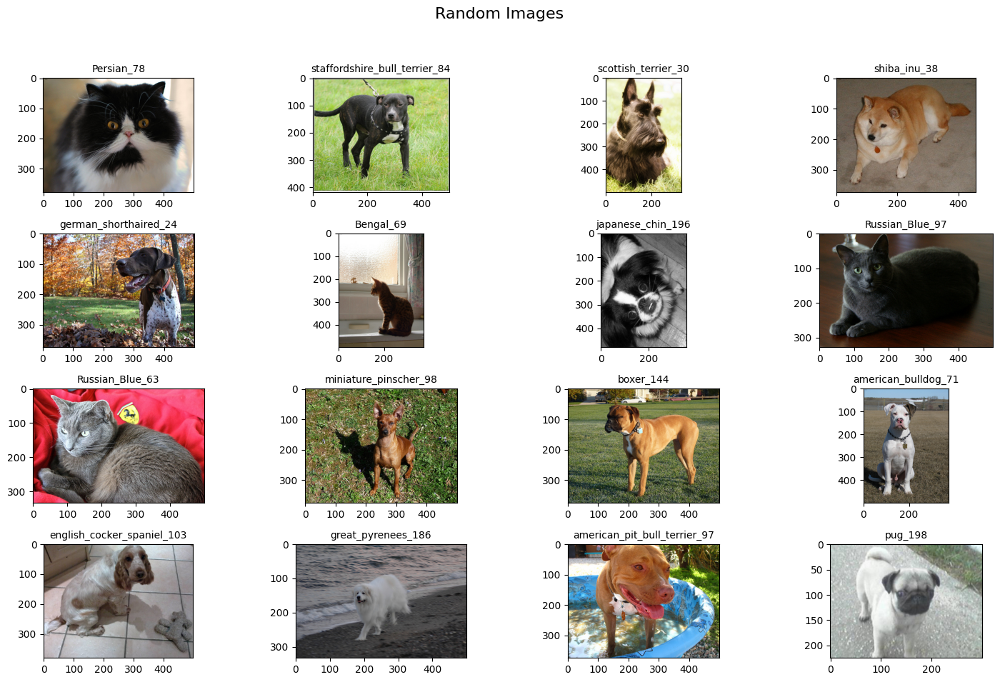
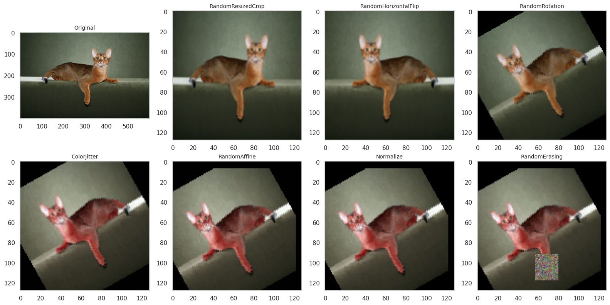
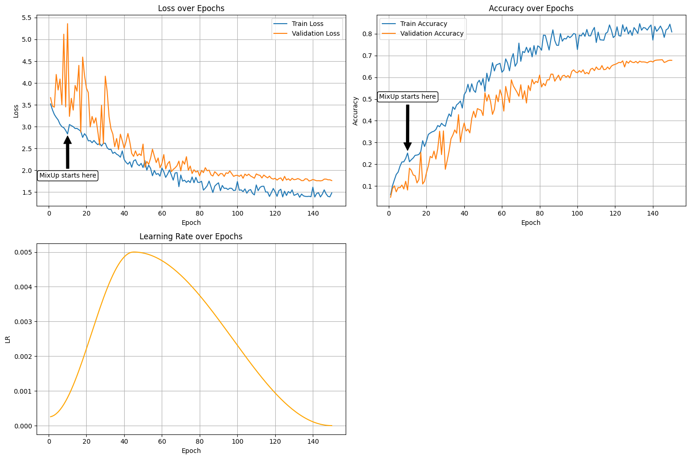
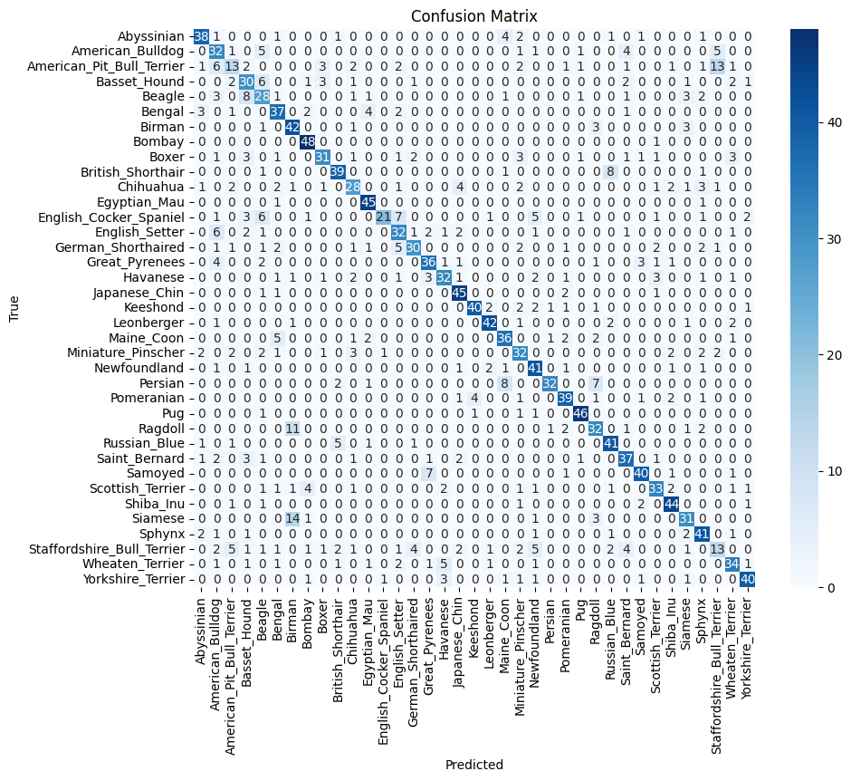
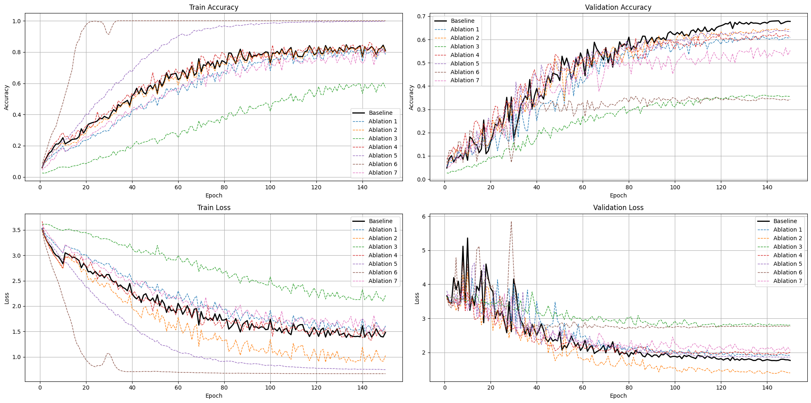

# Oxford-IIIT Pet Classification

> **Assignment Module 2 — Machine Learning for Computer Vision**
> University of Bologna


## Overview

This project tackles fine-grained image classification of **37 breeds of cats and dogs** from the [Oxford-IIIT Pet Dataset](https://www.robots.ox.ac.uk/~vgg/data/pets/). The work is divided into two parts:

- **Part 1** — Design and train a custom CNN from scratch, targeting ≥ 60% test accuracy.
- **Part 2** — Fine-tune a pretrained **ResNet-18** (ImageNet-1K V1) to reach ≥ 90% test accuracy.

---

## Dataset

The dataset used is a custom split of the original Oxford-IIIT Pet dataset, with a **50 / 25 / 25 ratio** for train, validation, and test sets respectively.

| Split | Size |
|-------|------|
| Train | ~3,680 images |
| Validation | ~1,840 images |
| Test | ~1,840 images |

> **Note:** The relatively small training set makes data augmentation critical to avoid overfitting.



### Exploratory Data Analysis (EDA)

Before training, an EDA was conducted on three aspects:

1. **Image Dimensions** — Images have highly variable sizes and aspect ratios; most are clustered around 300–500px. This motivated resizing to a fixed resolution.
2. **Color Distribution** — Mean and standard deviation were computed **only on the training split** to avoid data leakage. ImageNet statistics (`mean=[0.485, 0.456, 0.406]`, `std=[0.229, 0.224, 0.225]`) were used for normalization.
3. **Class Balance** — The dataset is roughly balanced across the 37 classes.

---

## Part 1 — Custom CNN: PetNet

### Architecture

**PetNet** is a lightweight, modular convolutional neural network designed with configurable depth and pooling.

#### ConvBlock

Each `ConvBlock` consists of:
- Two consecutive `Conv2d` layers (3×3 kernel, padding=1)
- Optional `BatchNorm2d` after each convolution
- `ReLU` activation after each normalization
- Downsampling via stride=2 in the first convolution

```python
class ConvBlock(nn.Module):
    def __init__(self, in_channels, out_channels, downsample=False, use_batchnorm=True):
        # Conv → BN → ReLU → Conv → BN → ReLU
        ...
```

#### PetNet

```
Input (3 × 128 × 128)
    │
    ▼
Initial Conv (3 → 32, 3×3) + BN + ReLU
    │
    ▼
ConvBlock (32 → 64,  stride=2)
ConvBlock (64 → 128, stride=2)
ConvBlock (128 → 256, stride=2)
ConvBlock (256 → 512, stride=2)
    │
    ▼
Global Average Pooling (AdaptiveAvgPool2d → 1×1)
    │
    ▼
Fully Connected (512 → 37)
```

**Constructor parameters:**

| Parameter | Default | Description |
|-----------|---------|-------------|
| `num_classes` | — | Number of output classes (37) |
| `num_blocks` | `4` | Number of ConvBlocks |
| `pool_type` | `"avg"` | `"avg"` (GAP) or `"max"` (GMP) |
| `use_batchnorm` | `True` | Whether to use Batch Normalization |

---

### Data Augmentation (Part 1)

A rich augmentation pipeline is applied **only to the training set**. The validation and test sets use only resize + normalize.

| Transform | Parameters | Purpose |
|-----------|-----------|---------|
| `RandomResizedCrop` | size=128, scale=(0.8, 1.2) | Scale/crop invariance |
| `RandomHorizontalFlip` | p=0.5 | Mirror symmetry |
| `RandomRotation` | degrees=30 | Rotation invariance |
| `ColorJitter` | brightness=0.2, contrast=0.2, saturation=0.2, hue=0.1 | Lighting robustness |
| `RandomAffine` | translate=(0.1, 0.1) | Positional invariance |
| `Normalize` | mean=[0.485,0.456,0.406], std=[0.229,0.224,0.225] | Distribution normalization |
| `RandomErasing` | p=0.5, scale=(0.02, 0.2) | Occlusion robustness |
| **MixUp** | α=0.4, starts at epoch 10 | Label smoothing via interpolation |



#### MixUp

MixUp generates new training samples by linearly interpolating pairs of images and their one-hot labels:

$$\tilde{x} = \lambda x_i + (1-\lambda) x_j, \quad \tilde{y} = \lambda y_i + (1-\lambda) y_j$$

where $\lambda \sim \text{Beta}(\alpha, \alpha)$. This encourages the model to learn smoother decision boundaries and improves generalization on small datasets. MixUp is activated starting from epoch 10 to allow the model to first learn stable feature representations.

---

### Training Pipeline

- **Loss:** `CrossEntropyLoss` with label smoothing
- **Optimizer:** `AdamW` — decouples weight decay from gradient updates, improving regularization vs. standard Adam
- **Scheduler:** `OneCycleLR` with cosine annealing — applies a warm-up phase followed by a cosine decay, promoting better convergence and generalization
- **Reproducibility:** Fixed random seed (`seed=115`) across NumPy, Python `random`, PyTorch CPU and CUDA; `cudnn.deterministic=True`, `cudnn.benchmark=False`


---

### Part 1 Results

| Model | Test Accuracy |
|-------|--------------|
| **Baseline (PetNet)** | **70.48%** |



---

## Part 1 — Ablation Study

An ablation study was conducted to quantify the contribution of each architectural and training component. All ablated variants were trained with the **same hyperparameters** as the baseline, changing only the indicated component.

| Name | Component Changed | Description |
|------|-------------------|-------------|
| `baseline` | — | PetNet (4 blocks, GAP, BN, full augmentation + MixUp) |
| `ablation_1` | Architecture depth | 3 ConvBlocks instead of 4 |
| `ablation_2` | Regularization | Label smoothing removed (→ 0) |
| `ablation_3` | Normalization | BatchNorm removed from ConvBlocks |
| `ablation_4` | Pooling | Global Max Pooling instead of GAP |
| `ablation_5` | Data Augmentation | MixUp removed |
| `ablation_6` | Data Augmentation | Only resize (no augmentation pipeline) |
| `ablation_7` | LR Scheduler | Constant LR (no OneCycleLR) |

### Results

| Variant | Test Accuracy | Δ vs Baseline |
|---------|--------------|---------------|
| **baseline** | **70.48%** | — |
| ablation_1 (3 blocks) | < baseline | Reduced depth hurts feature extraction |
| ablation_2 (no label smoothing) | Lower val loss but worse generalization | Model becomes overconfident |
| ablation_3 (no BN) | Significant drop | Training instability, slower convergence |
| ablation_4 (MaxPool) | Moderate drop | GAP averages spatial info more robustly |
| ablation_5 (no MixUp) | 67.98% | −3.55% |
| ablation_6 (only resize) | Largest drop | No diversity → severe overfitting |
| ablation_7 (no scheduler) | Moderate drop | Unstable convergence |



### Key Findings

- **Data augmentation** (especially MixUp) is the single most impactful component for generalization on small datasets. Removing all augmentation caused the largest accuracy drop.
- **Batch Normalization** is critical: without it, training becomes unstable and representations degrade significantly.
- **Model depth** (4 vs. 3 blocks) contributes positively but increases FLOPs and parameters.
- **Global Average Pooling** outperforms Global Max Pooling in the classification head by averaging spatial responses rather than selecting peak activations, yielding a more robust summary.
- **Label Smoothing** provides a moderate regularization benefit; removing it lowers validation loss numerically (the model pushes correct class scores toward infinity) but decreases generalization.
- **OneCycleLR** provides better convergence dynamics and final accuracy compared to a constant learning rate.

---

## Part 2 — Fine-Tuning ResNet-18

### Model Setup

A pretrained **ResNet-18** (ImageNet-1K V1) is used. The final fully connected layer is replaced to output 37 classes. A helper `set_requires_grad(layer, False)` is used to freeze/unfreeze layers selectively.

### 2A — Original Hyperparameters (Transfer Learning Baseline)

The same hyperparameters from Part 1 (128×128 input, batch=64, LR=1e-3, label smoothing=0.1, MixUp=0.4) are applied, with **all layers frozen except the final classifier**.

| Setting | Value |
|---------|-------|
| Frozen layers | conv1, bn1, layer1–layer4 |
| Trainable | fc only |
| Input size | 128 × 128 |
| Test accuracy | **62.57%** |

This result reveals that directly reusing hyperparameters tuned for a small custom CNN is suboptimal for a pretrained deep network, especially when the input resolution differs from the ImageNet standard.

---

### 2B — Hyperparameter Tuning

A progressive refinement strategy was applied, introducing one change at a time:

#### Step 1 — Correct Input Resolution

ResNet-18 was pretrained on 224×224 ImageNet images. Resizing inputs to match this expectation dramatically aligns the pretrained filters with the data.

| Config | resize | crop | label_smoothing | MixUp | Test Accuracy | Δ |
|--------|--------|------|----------------|-------|--------------|---|
| Original HPs | 128 | 128 | 0.1 | 0.4 | 62.57% | — |
| **Resized** | 256 | 224 | 0.1 | 0.4 | **85.32%** | +36.36% |

#### Step 2 — Reducing Aggressive Augmentations

Since ResNet-18 is already pretrained on a large diverse dataset, aggressive augmentations add noise rather than useful variation. Kept only mild ColorJitter; removed RandomRotation, RandomAffine, and random scale in RandomResizedCrop.

| Config | Augmentations | Test Accuracy | Δ |
|--------|--------------|--------------|---|
| Resized | Full pipeline | 85.32% | — |
| **Lowered Augmentations** | Mild ColorJitter only | **88.03%** | +3.11% |

#### Step 3 — Removing Label Smoothing and MixUp

With only the classifier unfrozen and a pretrained backbone, label smoothing and MixUp introduced unnecessary abstraction and hindered confident learning.

| Config | label_smoothing | MixUp | Test Accuracy | Δ |
|--------|----------------|-------|--------------|---|
| Lowered Augmentations | 0.1 | 0.4 | 88.03% | — |
| **No Smoothing / No MixUp** | 0 | 0 | **89.17%** | +1.29% |

---

### Progressive Layer Unfreezing

After reaching strong performance by tuning only the classifier, deeper layers of ResNet-18 were **progressively unfrozen** using **layer-wise learning rates** to avoid catastrophic forgetting.

**Strategy:** Earlier layers (edges, textures) are updated with very small LRs; deeper layers (task-specific representations) receive higher LRs.

| Unfrozen Layers | fc LR | layer4 LR | layer3 LR | layer2 LR | layer1 LR | label_smoothing | MixUp | Test Accuracy |
|----------------|-------|-----------|-----------|-----------|-----------|----------------|-------|--------------|
| fc only | 1e-3 | — | — | — | — | 0 | 0 | 89.17% |
| fc + layer4 | 1e-3 | 1e-4 | — | — | — | 0.01 | 0.01 | ~89.3% |
| fc + layer4–3 | 1e-3 | 1e-4 | 1e-5 | — | — | 0.02 | 0.1 | ~89.5% |
| fc + layer4–2 | 1e-3 | 1e-4 | 1e-5 | 1e-6 | — | progressive | progressive | ~89.6% |
| **fc + layer4–1** | **1e-3** | **1e-4** | **1e-5** | **1e-6** | **1e-7** | reintroduced | reintroduced | **89.71%** |

> As more residual layers are unfrozen, label smoothing and MixUp are **gradually reintroduced** to counteract the increasing risk of overfitting from higher model capacity.

#### Why Layer-Wise Learning Rates?

- **Classifier head (fc):** Must adapt most aggressively to the new task → highest LR (1e-3).
- **Deep residual blocks (layer4, layer3):** Task-specific representations → moderate LRs (1e-4, 1e-5).
- **Shallow residual blocks (layer2, layer1):** Generic low-level features (edges, textures) shared across domains → very small LRs (1e-6, 1e-7) to preserve pretrained knowledge.

Without this strategy, preliminary experiments showed **loss spikes and convergence instability**.

---

### Part 2 Summary

| Configuration | Trainable Params | MFLOPs | Test Accuracy |
|---------------|-----------------|--------|--------------|
| Original HPs (128px) | ~0.5M (fc only) | ~1,189 | 62.57% |
| Resized (224px) | ~0.5M (fc only) | ~3,643 | 85.32% |
| Lowered Augmentations | ~0.5M (fc only) | ~3,643 | 88.03% |
| No Smoothing / No MixUp | ~0.5M (fc only) | ~3,643 | 89.17% |
| + Unfreeze layer4 | ~3.7M | ~10.44 | ~89.3% |
| + Unfreeze layer3 | ~5.9M | ~11.1 | ~89.5% |
| + Unfreeze layer2 | ~8.4M | ~11.9 | ~89.6% |
| **+ Unfreeze layer1 (best)** | **~11.19M** | **~12.69** | **89.71%** |

Progressive unfreezing increased the total parameter count by **~33%** and FLOPs by **~21%** compared to the classifier-only baseline, while yielding the best test accuracy.

---

## Final Comparison: Part 1 vs Part 2

| | PetNet (from scratch) | ResNet-18 (fine-tuned) |
|--|----------------------|----------------------|
| **Test Accuracy** | 70.48% | **89.71%** |
| **Training Epochs** | 150 | 50 |
| **Input Size** | 128 × 128 | 224 × 224 |
| **Parameters** | ~few M (lightweight) | ~11.19M (full fine-tune) |
| **Prior Knowledge** | None | ImageNet-1K |
| **Augmentation** | Full aggressive pipeline | Mild ColorJitter |
| **MixUp** | ✅ (α=0.4, from epoch 10) | Reintroduced progressively |
| **Label Smoothing** | 0.1 | Reintroduced progressively |

### Key Takeaways

- Transfer learning with ResNet-18 achieves **+27% accuracy** over the custom model with fewer epochs and simpler augmentation.
- The pretrained backbone already encodes rich hierarchical filters (edges → textures → parts → semantics), enabling efficient domain adaptation.
- The most impactful single change in Part 2 was **aligning the input resolution** with ImageNet's 224×224 standard (+36% accuracy).
- Progressive layer unfreezing with layer-wise LRs is a reliable strategy to further squeeze out performance while avoiding catastrophic forgetting.
- For the custom model (Part 1), **data augmentation** (especially MixUp) was the most critical factor for generalization given the small dataset size.

---


## References

- Parkhi et al., *Cats and Dogs*, CVPR 2012 — [Oxford-IIIT Pet Dataset](https://www.robots.ox.ac.uk/~vgg/data/pets/)
- He et al., *Deep Residual Learning for Image Recognition*, CVPR 2016
- Zhang et al., *mixup: Beyond Empirical Risk Minimization*, ICLR 2018
- Loshchilov & Hutter, *Decoupled Weight Decay Regularization (AdamW)*, ICLR 2019
- Smith & Topin, *Super-Convergence: Very Fast Training of Neural Networks Using Large Learning Rates (OneCycleLR)*, 2018
- Müller et al., *When Does Label Smoothing Help?*, NeurIPS 2019
